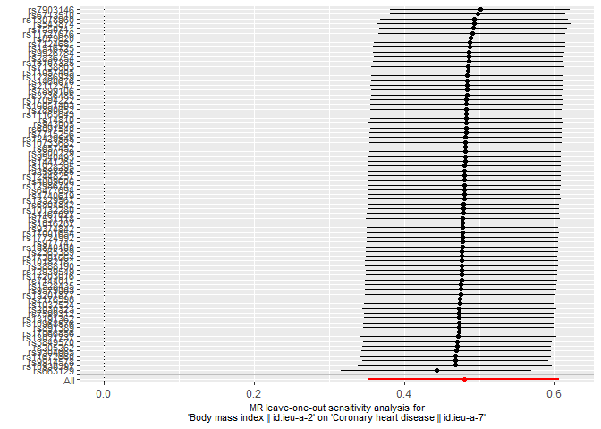

Two-sample MR using TwoSampleMR
================

Guide: <https://mrcieu.github.io/TwoSampleMR/> Github:
<https://github.com/kfdekkers/mr/>

``` r
# load libraries
library(TwoSampleMR)

## UNIVARIABLE MR ##

# # define exposure and outcome
# exposure_id <- "ieu-a-2" # BMI
# outcome_id <- "ieu-a-7" # Coronary heart disease

# # get exposure data
# exposure_data <- extract_instruments(
#     outcomes = exposure_id,
#     p1 = 5e-8,
#     clump = 1
# )

# # get outcome data
# outcome_data <- extract_outcome_data(
#     snps = exposure_data$SNP,
#     outcomes = outcome_id,
#     proxies = TRUE
# )

# # save data
# write.csv(exposure_data, file = "exposure_data.csv")
# write.csv(outcome_data, file = "outcome_data.csv")

# read data
exposure_data <- read.csv("https://raw.githubusercontent.com/kfdekkers/mr/refs/heads/main/exposure_data.csv") # BMI
outcome_data <- read.csv("https://raw.githubusercontent.com/kfdekkers/mr/refs/heads/main/outcome_data.csv") # CHD

# harmonize data
harmonized_data <- harmonise_data(exposure_dat = exposure_data, outcome_dat = outcome_data)
```

    ## Harmonising Body mass index || id:ieu-a-2 (ieu-a-2) and Coronary heart disease || id:ieu-a-7 (ieu-a-7)

    ## Removing the following SNPs for being palindromic with intermediate allele frequencies:
    ## rs1558902

``` r
# perform MR
mr_results <- mr(harmonized_data, method_list = c("mr_ivw", "mr_egger_regression", "mr_weighted_median"))
```

    ## Analysing 'ieu-a-2' on 'ieu-a-7'

``` r
print(mr_results)
```

    ##   id.exposure id.outcome                              outcome
    ## 1     ieu-a-2    ieu-a-7 Coronary heart disease || id:ieu-a-7
    ## 2     ieu-a-2    ieu-a-7 Coronary heart disease || id:ieu-a-7
    ## 3     ieu-a-2    ieu-a-7 Coronary heart disease || id:ieu-a-7
    ##                        exposure                    method nsnp         b
    ## 1 Body mass index || id:ieu-a-2 Inverse variance weighted   77 0.4795636
    ## 2 Body mass index || id:ieu-a-2                  MR Egger   77 0.5480371
    ## 3 Body mass index || id:ieu-a-2           Weighted median   77 0.5020780
    ##           se         pval
    ## 1 0.06453223 1.074690e-13
    ## 2 0.18668642 4.417059e-03
    ## 3 0.07502106 2.193997e-11

``` r
mr_or_results <- generate_odds_ratios(mr_results)
print(mr_or_results)
```

    ##   id.exposure id.outcome                              outcome
    ## 1     ieu-a-2    ieu-a-7 Coronary heart disease || id:ieu-a-7
    ## 2     ieu-a-2    ieu-a-7 Coronary heart disease || id:ieu-a-7
    ## 3     ieu-a-2    ieu-a-7 Coronary heart disease || id:ieu-a-7
    ##                        exposure                    method nsnp         b
    ## 1 Body mass index || id:ieu-a-2 Inverse variance weighted   77 0.4795636
    ## 2 Body mass index || id:ieu-a-2                  MR Egger   77 0.5480371
    ## 3 Body mass index || id:ieu-a-2           Weighted median   77 0.5020780
    ##           se         pval     lo_ci     up_ci       or or_lci95 or_uci95
    ## 1 0.06453223 1.074690e-13 0.3530804 0.6060468 1.615369 1.423446 1.833170
    ## 2 0.18668642 4.417059e-03 0.1821318 0.9139425 1.729854 1.199772 2.494136
    ## 3 0.07502106 2.193997e-11 0.3550367 0.6491193 1.652151 1.426233 1.913854

``` r
# sensitivity analysis
leave_one_out <- mr_leaveoneout(harmonized_data)
print(leave_one_out)
```

    ##                         exposure                              outcome
    ## 1  Body mass index || id:ieu-a-2 Coronary heart disease || id:ieu-a-7
    ## 2  Body mass index || id:ieu-a-2 Coronary heart disease || id:ieu-a-7
    ## 3  Body mass index || id:ieu-a-2 Coronary heart disease || id:ieu-a-7
    ## 4  Body mass index || id:ieu-a-2 Coronary heart disease || id:ieu-a-7
    ## 5  Body mass index || id:ieu-a-2 Coronary heart disease || id:ieu-a-7
    ## 6  Body mass index || id:ieu-a-2 Coronary heart disease || id:ieu-a-7
    ## 7  Body mass index || id:ieu-a-2 Coronary heart disease || id:ieu-a-7
    ## 8  Body mass index || id:ieu-a-2 Coronary heart disease || id:ieu-a-7
    ## 9  Body mass index || id:ieu-a-2 Coronary heart disease || id:ieu-a-7
    ## 10 Body mass index || id:ieu-a-2 Coronary heart disease || id:ieu-a-7
    ## 11 Body mass index || id:ieu-a-2 Coronary heart disease || id:ieu-a-7
    ## 12 Body mass index || id:ieu-a-2 Coronary heart disease || id:ieu-a-7
    ## 13 Body mass index || id:ieu-a-2 Coronary heart disease || id:ieu-a-7
    ## 14 Body mass index || id:ieu-a-2 Coronary heart disease || id:ieu-a-7
    ## 15 Body mass index || id:ieu-a-2 Coronary heart disease || id:ieu-a-7
    ## 16 Body mass index || id:ieu-a-2 Coronary heart disease || id:ieu-a-7
    ## 17 Body mass index || id:ieu-a-2 Coronary heart disease || id:ieu-a-7
    ## 18 Body mass index || id:ieu-a-2 Coronary heart disease || id:ieu-a-7
    ## 19 Body mass index || id:ieu-a-2 Coronary heart disease || id:ieu-a-7
    ## 20 Body mass index || id:ieu-a-2 Coronary heart disease || id:ieu-a-7
    ## 21 Body mass index || id:ieu-a-2 Coronary heart disease || id:ieu-a-7
    ## 22 Body mass index || id:ieu-a-2 Coronary heart disease || id:ieu-a-7
    ## 23 Body mass index || id:ieu-a-2 Coronary heart disease || id:ieu-a-7
    ## 24 Body mass index || id:ieu-a-2 Coronary heart disease || id:ieu-a-7
    ## 25 Body mass index || id:ieu-a-2 Coronary heart disease || id:ieu-a-7
    ## 26 Body mass index || id:ieu-a-2 Coronary heart disease || id:ieu-a-7
    ## 27 Body mass index || id:ieu-a-2 Coronary heart disease || id:ieu-a-7
    ## 28 Body mass index || id:ieu-a-2 Coronary heart disease || id:ieu-a-7
    ## 29 Body mass index || id:ieu-a-2 Coronary heart disease || id:ieu-a-7
    ## 30 Body mass index || id:ieu-a-2 Coronary heart disease || id:ieu-a-7
    ## 31 Body mass index || id:ieu-a-2 Coronary heart disease || id:ieu-a-7
    ## 32 Body mass index || id:ieu-a-2 Coronary heart disease || id:ieu-a-7
    ## 33 Body mass index || id:ieu-a-2 Coronary heart disease || id:ieu-a-7
    ## 34 Body mass index || id:ieu-a-2 Coronary heart disease || id:ieu-a-7
    ## 35 Body mass index || id:ieu-a-2 Coronary heart disease || id:ieu-a-7
    ## 36 Body mass index || id:ieu-a-2 Coronary heart disease || id:ieu-a-7
    ## 37 Body mass index || id:ieu-a-2 Coronary heart disease || id:ieu-a-7
    ## 38 Body mass index || id:ieu-a-2 Coronary heart disease || id:ieu-a-7
    ## 39 Body mass index || id:ieu-a-2 Coronary heart disease || id:ieu-a-7
    ## 40 Body mass index || id:ieu-a-2 Coronary heart disease || id:ieu-a-7
    ## 41 Body mass index || id:ieu-a-2 Coronary heart disease || id:ieu-a-7
    ## 42 Body mass index || id:ieu-a-2 Coronary heart disease || id:ieu-a-7
    ## 43 Body mass index || id:ieu-a-2 Coronary heart disease || id:ieu-a-7
    ## 44 Body mass index || id:ieu-a-2 Coronary heart disease || id:ieu-a-7
    ## 45 Body mass index || id:ieu-a-2 Coronary heart disease || id:ieu-a-7
    ## 46 Body mass index || id:ieu-a-2 Coronary heart disease || id:ieu-a-7
    ## 47 Body mass index || id:ieu-a-2 Coronary heart disease || id:ieu-a-7
    ## 48 Body mass index || id:ieu-a-2 Coronary heart disease || id:ieu-a-7
    ## 49 Body mass index || id:ieu-a-2 Coronary heart disease || id:ieu-a-7
    ## 50 Body mass index || id:ieu-a-2 Coronary heart disease || id:ieu-a-7
    ## 51 Body mass index || id:ieu-a-2 Coronary heart disease || id:ieu-a-7
    ## 52 Body mass index || id:ieu-a-2 Coronary heart disease || id:ieu-a-7
    ## 53 Body mass index || id:ieu-a-2 Coronary heart disease || id:ieu-a-7
    ## 54 Body mass index || id:ieu-a-2 Coronary heart disease || id:ieu-a-7
    ## 55 Body mass index || id:ieu-a-2 Coronary heart disease || id:ieu-a-7
    ## 56 Body mass index || id:ieu-a-2 Coronary heart disease || id:ieu-a-7
    ## 57 Body mass index || id:ieu-a-2 Coronary heart disease || id:ieu-a-7
    ## 58 Body mass index || id:ieu-a-2 Coronary heart disease || id:ieu-a-7
    ## 59 Body mass index || id:ieu-a-2 Coronary heart disease || id:ieu-a-7
    ## 60 Body mass index || id:ieu-a-2 Coronary heart disease || id:ieu-a-7
    ## 61 Body mass index || id:ieu-a-2 Coronary heart disease || id:ieu-a-7
    ## 62 Body mass index || id:ieu-a-2 Coronary heart disease || id:ieu-a-7
    ## 63 Body mass index || id:ieu-a-2 Coronary heart disease || id:ieu-a-7
    ## 64 Body mass index || id:ieu-a-2 Coronary heart disease || id:ieu-a-7
    ## 65 Body mass index || id:ieu-a-2 Coronary heart disease || id:ieu-a-7
    ## 66 Body mass index || id:ieu-a-2 Coronary heart disease || id:ieu-a-7
    ## 67 Body mass index || id:ieu-a-2 Coronary heart disease || id:ieu-a-7
    ## 68 Body mass index || id:ieu-a-2 Coronary heart disease || id:ieu-a-7
    ## 69 Body mass index || id:ieu-a-2 Coronary heart disease || id:ieu-a-7
    ## 70 Body mass index || id:ieu-a-2 Coronary heart disease || id:ieu-a-7
    ## 71 Body mass index || id:ieu-a-2 Coronary heart disease || id:ieu-a-7
    ## 72 Body mass index || id:ieu-a-2 Coronary heart disease || id:ieu-a-7
    ## 73 Body mass index || id:ieu-a-2 Coronary heart disease || id:ieu-a-7
    ## 74 Body mass index || id:ieu-a-2 Coronary heart disease || id:ieu-a-7
    ## 75 Body mass index || id:ieu-a-2 Coronary heart disease || id:ieu-a-7
    ## 76 Body mass index || id:ieu-a-2 Coronary heart disease || id:ieu-a-7
    ## 77 Body mass index || id:ieu-a-2 Coronary heart disease || id:ieu-a-7
    ## 78 Body mass index || id:ieu-a-2 Coronary heart disease || id:ieu-a-7
    ##    id.exposure id.outcome samplesize        SNP         b         se
    ## 1      ieu-a-2    ieu-a-7     184305 rs10132280 0.4788869 0.06526458
    ## 2      ieu-a-2    ieu-a-7     184305  rs1016287 0.4781371 0.06527487
    ## 3      ieu-a-2    ieu-a-7     184305 rs10182181 0.4767553 0.06573393
    ## 4      ieu-a-2    ieu-a-7     184305  rs1032524 0.4738485 0.06484867
    ## 5      ieu-a-2    ieu-a-7     184305 rs10733682 0.4816177 0.06519030
    ## 6      ieu-a-2    ieu-a-7     184305 rs10840100 0.4771849 0.06524111
    ## 7      ieu-a-2    ieu-a-7     184305 rs10938397 0.4675831 0.06593892
    ## 8      ieu-a-2    ieu-a-7     184305 rs10968576 0.4732555 0.06506103
    ## 9      ieu-a-2    ieu-a-7     184305 rs11057405 0.4847417 0.06464309
    ## 10     ieu-a-2    ieu-a-7     184305 rs11165643 0.4826698 0.06528984
    ## 11     ieu-a-2    ieu-a-7     184305 rs11672660 0.4686693 0.06472759
    ## 12     ieu-a-2    ieu-a-7     184305  rs1167827 0.4786496 0.06524860
    ## 13     ieu-a-2    ieu-a-7     184305 rs11727676 0.4902311 0.06355000
    ## 14     ieu-a-2    ieu-a-7     184305 rs12286929 0.4839547 0.06514300
    ## 15     ieu-a-2    ieu-a-7     184305 rs12429545 0.4816848 0.06537998
    ## 16     ieu-a-2    ieu-a-7     184305 rs12448257 0.4804691 0.06529069
    ## 17     ieu-a-2    ieu-a-7     184305 rs12939549 0.4765181 0.06511455
    ## 18     ieu-a-2    ieu-a-7     184305 rs12986742 0.4804522 0.06530250
    ## 19     ieu-a-2    ieu-a-7     184305 rs13021737 0.4722842 0.06660701
    ## 20     ieu-a-2    ieu-a-7     184305 rs13078960 0.4932961 0.06366147
    ## 21     ieu-a-2    ieu-a-7     184305 rs13107325 0.4857065 0.06488705
    ## 22     ieu-a-2    ieu-a-7     184305 rs13191362 0.4733280 0.06469055
    ## 23     ieu-a-2    ieu-a-7     184305 rs13201877 0.4748629 0.06477480
    ## 24     ieu-a-2    ieu-a-7     184305 rs13329567 0.4799096 0.06555697
    ## 25     ieu-a-2    ieu-a-7     184305  rs1441264 0.4808485 0.06516407
    ## 26     ieu-a-2    ieu-a-7     184305  rs1460676 0.4838111 0.06487966
    ## 27     ieu-a-2    ieu-a-7     184305    rs14810 0.4821851 0.06510763
    ## 28     ieu-a-2    ieu-a-7     184305  rs1516725 0.4866319 0.06551113
    ## 29     ieu-a-2    ieu-a-7     184305  rs1528435 0.4756665 0.06496876
    ## 30     ieu-a-2    ieu-a-7     184305 rs16851483 0.4829332 0.06550999
    ## 31     ieu-a-2    ieu-a-7     184305 rs17001654 0.4779485 0.06528106
    ## 32     ieu-a-2    ieu-a-7     184305 rs17066856 0.4726609 0.06498698
    ## 33     ieu-a-2    ieu-a-7     184305 rs17094222 0.4829641 0.06517075
    ## 34     ieu-a-2    ieu-a-7     184305 rs17203016 0.4763734 0.06501482
    ## 35     ieu-a-2    ieu-a-7     184305 rs17381664 0.4767668 0.06514526
    ## 36     ieu-a-2    ieu-a-7     184305 rs17724992 0.4776938 0.06518079
    ## 37     ieu-a-2    ieu-a-7     184305  rs1928295 0.4805399 0.06523003
    ## 38     ieu-a-2    ieu-a-7     184305  rs2030323 0.4733936 0.06586936
    ## 39     ieu-a-2    ieu-a-7     184305   rs205262 0.4699728 0.06409312
    ## 40     ieu-a-2    ieu-a-7     184305  rs2112347 0.4834047 0.06536104
    ## 41     ieu-a-2    ieu-a-7     184305  rs2176598 0.4738886 0.06461391
    ## 42     ieu-a-2    ieu-a-7     184305  rs2365389 0.4769288 0.06517871
    ## 43     ieu-a-2    ieu-a-7     184305  rs2588785 0.4804903 0.06531184
    ## 44     ieu-a-2    ieu-a-7     184305  rs2836754 0.4860914 0.06455435
    ## 45     ieu-a-2    ieu-a-7     184305  rs2890652 0.4826734 0.06515402
    ## 46     ieu-a-2    ieu-a-7     184305  rs3736485 0.4831339 0.06494784
    ## 47     ieu-a-2    ieu-a-7     184305  rs3800229 0.4813462 0.06513855
    ## 48     ieu-a-2    ieu-a-7     184305  rs3849570 0.4710555 0.06427789
    ## 49     ieu-a-2    ieu-a-7     184305  rs3888190 0.4766602 0.06560691
    ## 50     ieu-a-2    ieu-a-7     184305  rs4740619 0.4802699 0.06519643
    ## 51     ieu-a-2    ieu-a-7     184305  rs4889606 0.4804657 0.06518739
    ## 52     ieu-a-2    ieu-a-7     184305   rs543874 0.4929706 0.06582059
    ## 53     ieu-a-2    ieu-a-7     184305  rs6091540 0.4821508 0.06510524
    ## 54     ieu-a-2    ieu-a-7     184305  rs6477694 0.4804050 0.06518168
    ## 55     ieu-a-2    ieu-a-7     184305   rs657452 0.4814078 0.06535544
    ## 56     ieu-a-2    ieu-a-7     184305   rs663129 0.4426570 0.06469163
    ## 57     ieu-a-2    ieu-a-7     184305  rs6713510 0.4978557 0.05970075
    ## 58     ieu-a-2    ieu-a-7     184305  rs6804842 0.4790140 0.06523749
    ## 59     ieu-a-2    ieu-a-7     184305  rs7124681 0.4873249 0.06504869
    ## 60     ieu-a-2    ieu-a-7     184305  rs7138803 0.4853217 0.06565605
    ## 61     ieu-a-2    ieu-a-7     184305  rs7144011 0.4761034 0.06522364
    ## 62     ieu-a-2    ieu-a-7     184305  rs7531118 0.4781453 0.06579397
    ## 63     ieu-a-2    ieu-a-7     184305  rs7550711 0.4920787 0.06370958
    ## 64     ieu-a-2    ieu-a-7     184305  rs7599312 0.4733657 0.06473235
    ## 65     ieu-a-2    ieu-a-7     184305  rs7715256 0.4818659 0.06510090
    ## 66     ieu-a-2    ieu-a-7     184305  rs7899106 0.4833934 0.06488904
    ## 67     ieu-a-2    ieu-a-7     184305  rs7903146 0.5010110 0.06100754
    ## 68     ieu-a-2    ieu-a-7     184305   rs879620 0.4879629 0.06489115
    ## 69     ieu-a-2    ieu-a-7     184305   rs891389 0.4727536 0.06475231
    ## 70     ieu-a-2    ieu-a-7     184305  rs9304665 0.4693014 0.06439156
    ## 71     ieu-a-2    ieu-a-7     184305  rs9374842 0.4779613 0.06517102
    ## 72     ieu-a-2    ieu-a-7     184305   rs943005 0.4821563 0.06598825
    ## 73     ieu-a-2    ieu-a-7     184305  rs9540493 0.4808542 0.06520324
    ## 74     ieu-a-2    ieu-a-7     184305  rs9579083 0.4754401 0.06521228
    ## 75     ieu-a-2    ieu-a-7     184305   rs977747 0.4772174 0.06509587
    ## 76     ieu-a-2    ieu-a-7     184305  rs9914578 0.4678945 0.06337022
    ## 77     ieu-a-2    ieu-a-7     184305  rs9926784 0.4862133 0.06488630
    ## 78     ieu-a-2    ieu-a-7     184305        All 0.4795636 0.06453223
    ##               p
    ## 1  2.174199e-13
    ## 2  2.389351e-13
    ## 3  4.082294e-13
    ## 4  2.731967e-13
    ## 5  1.491962e-13
    ## 6  2.589674e-13
    ## 7  1.329976e-12
    ## 8  3.489310e-13
    ## 9  6.443445e-14
    ## 10 1.438510e-13
    ## 11 4.465692e-13
    ## 12 2.204273e-13
    ## 13 1.218381e-14
    ## 14 1.093291e-13
    ## 15 1.739009e-13
    ## 16 1.854025e-13
    ## 17 2.514104e-13
    ## 18 1.876227e-13
    ## 19 1.335248e-12
    ## 20 9.280996e-15
    ## 21 7.132167e-14
    ## 22 2.539475e-13
    ## 23 2.284730e-13
    ## 24 2.470553e-13
    ## 25 1.594297e-13
    ## 26 8.847874e-14
    ## 27 1.301964e-13
    ## 28 1.100589e-13
    ## 29 2.452786e-13
    ## 30 1.682112e-13
    ## 31 2.454044e-13
    ## 32 3.511669e-13
    ## 33 1.255884e-13
    ## 34 2.350976e-13
    ## 35 2.507225e-13
    ## 36 2.323071e-13
    ## 37 1.747055e-13
    ## 38 6.630031e-13
    ## 39 2.256361e-13
    ## 40 1.404373e-13
    ## 41 2.231195e-13
    ## 42 2.531073e-13
    ## 43 1.882820e-13
    ## 44 5.075764e-14
    ## 45 1.280343e-13
    ## 46 1.016052e-13
    ## 47 1.472985e-13
    ## 48 2.328800e-13
    ## 49 3.719474e-13
    ## 50 1.751579e-13
    ## 51 1.699494e-13
    ## 52 6.907823e-14
    ## 53 1.304465e-13
    ## 54 1.703142e-13
    ## 55 1.758318e-13
    ## 56 7.778479e-12
    ## 57 7.480342e-17
    ## 58 2.094568e-13
    ## 59 6.798980e-14
    ## 60 1.447668e-13
    ## 61 2.887255e-13
    ## 62 3.667101e-13
    ## 63 1.129317e-14
    ## 64 2.619046e-13
    ## 65 1.343177e-13
    ## 66 9.366722e-14
    ## 67 2.170277e-16
    ## 68 5.489605e-14
    ## 69 2.857361e-13
    ## 70 3.140209e-13
    ## 71 2.234588e-13
    ## 72 2.737828e-13
    ## 73 1.647187e-13
    ## 74 3.084582e-13
    ## 75 2.284532e-13
    ## 76 1.541724e-13
    ## 77 6.715659e-14
    ## 78 1.074690e-13

``` r
loo_plot <- mr_leaveoneout_plot(leave_one_out)
print(loo_plot[[1]])
```

    ## Warning: Removed 1 row containing missing values or values outside the scale range
    ## (`geom_point()`).

<!-- -->

``` r
## MULTIVARIABLE MR ##

# mv_exposure_id <- c(
#     "ieu-a-2", # BMI
#     "ieu-a-300" # LDL cholesterol
# )

# mv_outcome_id <- "ieu-a-7" # CHD

# mv_exposure_data <- mv_extract_exposures(id_exposure = mv_exposure_id)
# mv_outcome_data <- extract_outcome_data(snps = mv_exposure_data$SNP, outcomes = mv_outcome_id)

# write.csv(mv_exposure_data, file = "mv_exposure_data.csv")
# write.csv(mv_outcome_data, file = "mv_outcome_data.csv")

mv_exposure_data <- read.csv("https://raw.githubusercontent.com/kfdekkers/mr/refs/heads/main/mv_exposure_data.csv") # BMI and LDL cholesterol
mv_outcome_data <- read.csv("https://raw.githubusercontent.com/kfdekkers/mr/refs/heads/main/mv_outcome_data.csv") # CHD

mv_data <- mv_harmonise_data(exposure_dat = mv_exposure_data, outcome_dat = mv_outcome_data)
```

    ## Harmonising Body mass index || id:ieu-a-2 (ieu-a-2) and Coronary heart disease || id:ieu-a-7 (ieu-a-7)

``` r
mv_results <- mv_multiple(mvdat = mv_data)
print(mv_results)
```

    ## $result
    ##   id.exposure                        exposure id.outcome
    ## 1     ieu-a-2   Body mass index || id:ieu-a-2    ieu-a-7
    ## 2   ieu-a-300 LDL cholesterol || id:ieu-a-300    ieu-a-7
    ##                                outcome nsnp         b         se         pval
    ## 1 Coronary heart disease || id:ieu-a-7   63 0.4437001 0.08592352 2.418614e-07
    ## 2 Coronary heart disease || id:ieu-a-7   60 0.3984016 0.03763755 3.489670e-26
